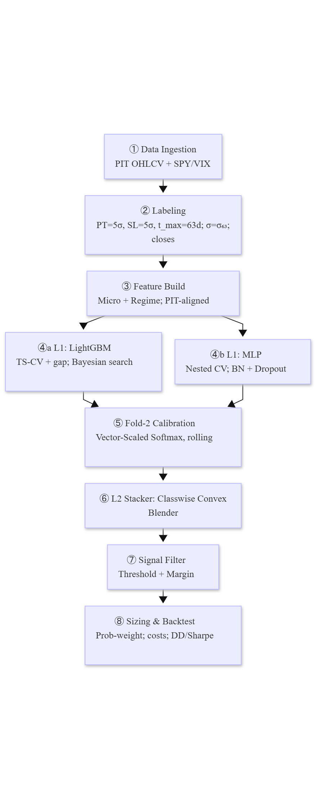

# Meta-Labeling Alpha Filter

**A Systematic Signal Refinement Framework**

We turn a noisy momentum sleeve into a disciplined, probability-aware process. A calibrated meta-model predicts the chance each candidate trade will resolve within horizon; we gate and size by that probability and execute with realistic hygiene (close→next-close, asymmetric costs, EWMA vol target, leverage cap). The result is a diversifying sleeve that deploys cleanly as a 50/50 blend with SPY.

---

## Fold-3 Out-of-Sample Summary (2020-01-01 to 2024-12-31, net of costs)
   - **Meta-Labeled Strategy (net):** 12.17% return @ 19.51% vol, Sharpe 0.62, β ≈ −0.11, ρ ≈ −0.12, max DD −28.07%.
   - **50/50 SPY + Strategy (net):** 14.64% return @ 13.43% vol, Sharpe 1.09, max DD −28.07% (SPY −33.72%).
   - **Beta-neutral (net):** 14.20% return @ 19.36% vol, Sharpe 0.73, β ≈ 0 (by design).
   - **Trade quality:** 3,612 trades, 65.75% win rate, PF 2.92, avg holding 24.2d.

Full tables/figures are in the [case report PDF](docs/Meta-Labeling%20Alpha%20Filter%20-%20Case%20Report.pdf) and under `results/` & `figures/`.

[⬇️ Download the PDF](https://github.com/gautierpetit/meta-labeling-alpha-filter/blob/main/docs/Meta-Labeling%20Alpha%20Filter%20-%20Case%20Report.pdf?raw=1)


This project emphasizes rigorous data hygiene, explicit out-of-sample evaluation, calibration-first modeling, probability-aware execution, and realistic portfolio frictions. It is intended as a research case study in systematic signal refinement rather than a claim of production-ready live performance.

---

## What this repo contains

   - **Case study PDF:** professional write-up with methods, diagnostics, and results (/docs/Meta-Labeling Alpha Filter - Case Report.pdf).
   - **Reproducible pipeline:** point-in-time (PIT) universe, leakage-safe labeling, calibrated base models, classwise convex blender stacker, probability-aware execution, costs, and risk overlays.
   - **Artifacts:** run manifest, config snapshot, and fold fingerprints saved per run for traceability.
---

## Pipeline at a glance

<p align="center">
  
</p>


> **Branches.** `main` contains the classwise convex blender stacker used for the reported results. [`experimental`](../../tree/experimental) preserves MLP stacker variants and related meta-feature experiments for reference.

---

## Key ideas
   - **Filter first, trade second.** We predict resolution (TP before SL/timeout), not raw direction.
   - **Calibration before control.** Decisions ride on calibrated class probabilities; thresholds, margins, and sizes are meaningful only if probabilities are reliable.
   - **Stack on probabilities, not features.** A classwise convex blender combines LightGBM & MLPv1 after calibration—stable, leakage-safe, and monotone.
   - **Execution hygiene.** Close→next-close PnL, asymmetric long/short costs on executed turnover, EWMA(63) vol targeting to a risk budget, and a hard gross cap.

---

## Quickstart

```
# 1) Install
python -m venv .venv && source .venv/bin/activate   # (Windows: .venv\Scripts\activate)
pip install -r requirements.txt

# 2) Put inputs in place (one-time)
#   data/ should contain:
#     - S&P 500 PIT constituents snapshot (CSV you downloaded at project start)
#     - FRED series (DGS10, T10Y3M) as CSVs
#   Then fetch OHLCV via:
python -m src.data_download

# 3) Run the full pipeline (Fold-1→3)
python -m src.main

# 4) Browse results
open results/performance_summary.xlsx

```

Outputs:
- `results/performance_summary.xlsx` — headline summary table used in the report
- `results/` — backtest tables, strategy plots, and model diagnostics
- `shap/` — SHAP summaries and explainability outputs
- `runs/<timestamp>/` — full run snapshot including manifests, fingerprints, logs, and generated artifacts
- `docs/` — polished case report PDF: *Meta-Labeling Alpha Filter - Case Report.pdf*

> Note: blend and beta-neutral variants show N/A for trade-level statistics by design, since they are portfolio constructs rather than direct trade streams.
---

## Configuration (edit `config.py`)

- **Labeling:** `PT_SL_FACTOR=(5,5)`, `MAX_HOLDING_PERIOD=63`, `VOL_WINDOW=63`.
`THRESHOLD_LONG=0.45`, `..._SHORT=0.50`, `MIN_GAP=0.10`, `TOP_K_PER_DAY=3`, `META_SCORE_MODE="edge"`.
- **Sizing:** `PROB_WEIGHTING=True`, `WEIGHT_MODE="margin"`.
- **Risk:** `TARGET_VOL=0.20`, `VOL_SPAN=63`, `LEVERAGE_CAP=3`.
- **Costs:** `LONG_SIDE_TC=10` bps, `SHORT_SIDE_TC=20` bps (per-side, on executed turnover).

> Defaults are conservative; thresholds, Top-K, and risk caps are easy to sweep.

---

## Reproducibility & leakage controls
- PIT S&P 500 membership and symbol normalization; SPY/VIX context series snapshotted.
- Time-ordered folds: discovery (Fold-1), calibration + stacker (Fold-2), true OOS (Fold-3).
- Leakage-safe calibration: vector-scaled softmax fit only on prior data; applied forward.
- Determinism: global seeds; manifests and config snapshots written each run.

Every run writes: manifest.json (env + code hash), config_snapshot.json (resolved parameters), fold_fingerprints.json (fold dates/hashes), and run.log.jsonl (timeline).

Data sources: S&P 500 PIT membership (Aultman, MIT-licensed snapshot), Yahoo Finance OHLCV (auto-adjusted), SPY/VIX context; FRED 10Y and 10Y–3M.

---

## Repo structure

```
meta-labeling-alpha-filter/
├── data/                 # inputs: PIT constituents snapshot, FRED CSVs (DGS10, T10Y3M), yfinance caches
├── docs/                 # the PDF case report
├── figures/              # GENERATED: model calibration curves and diagnostics
├── models/               # GENERATED: saved models
├── results/              # GENERATED: backtest tables/plots and model diagnostics
├── runs/                 # GENERATED: per-run folders (manifests, fingerprints, logs)
├── shap/                 # GENERATED: SHAP summaries & values
├── src/                  # code (orchestrator + modules)
│   ├── main.py           # orchestrates the full pipeline end-to-end
│   ├── config.py         # single source of truth for folds, costs, sizing knobs, thresholds
│   ├── data_download.py  # PIT OHLCV (yfinance), SPY/VIX; writes parquet
│   ├── data_loader.py    # leak-safe loaders; alignment & resampling
│   ├── labeling.py       # triple-barrier labels
│   ├── features.py       # point-in-time feature set (micro + regime)
│   ├── modeling.py       # LightGBM w/ TS-CV + calibration
│   ├── mlp_modeling.py   # MLP w/ nested TS-CV + calibration
│   ├── analysis.py       # model diagnostics (AUC/log-loss, reliability, SHAP hooks)
│   ├── signals.py        # gating (threshold + gap), ranking (edge/logit_edge), Top-K
│   ├── sizing.py         # prob→weights maps, λ-blend (hysteresis), vol-target, leverage cap, costs
│   ├── evaluation.py     # PnL, alpha/beta, underwater, rolling Sharpe/corr; summary table
│   ├── strategy.py       # base cross-sectional momentum logic
│   └── utils.py / notifications.py
├── config_snapshot.json  # latest run’s resolved config (handy to diff)
├── fold_fingerprints.json# fold boundaries + hashes for reproducibility
├── manifest.json         # environment + code hash snapshot
├── run.log.jsonl         # per-run log with time stamps and key events

```

---

## License

The source code in this repository is licensed under the **BSD 3-Clause License**. See the `LICENSE` file for details.

The case report in `docs/` remains licensed separately under the **Creative Commons Attribution-NonCommercial-NoDerivatives 4.0 International License (CC BY-NC-ND 4.0)**.

## Contact

**Gautier Petit** 

- [GitHub](https://github.com/gautierpetit): gautierpetit
- [LinkedIn](https://www.linkedin.com/in/gautierpetitch): gautierpetitch
